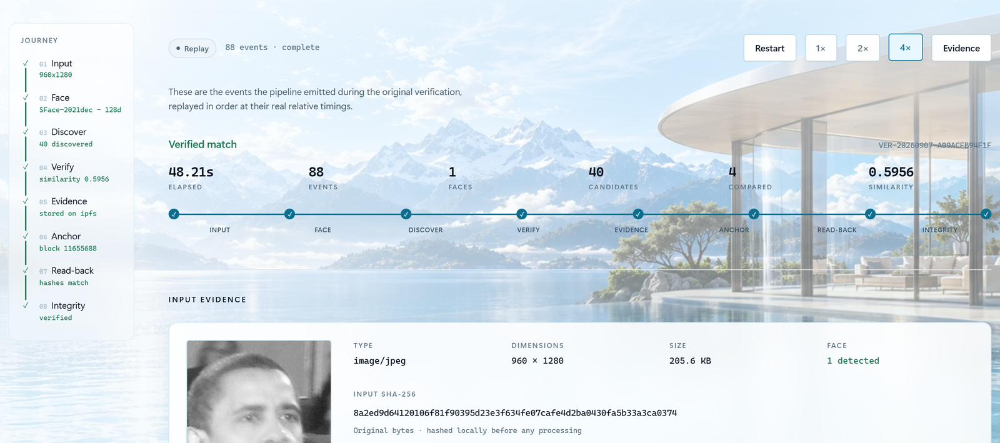
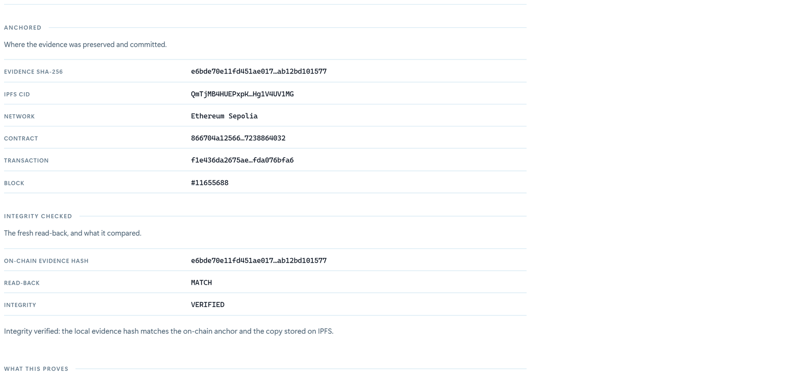
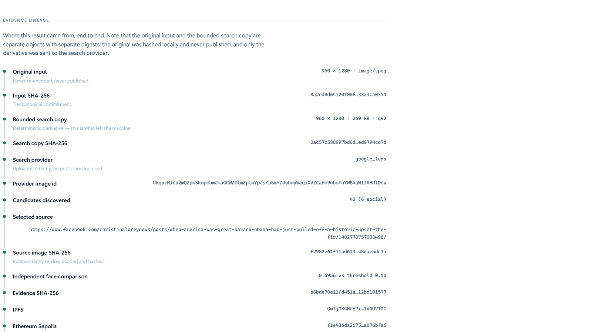
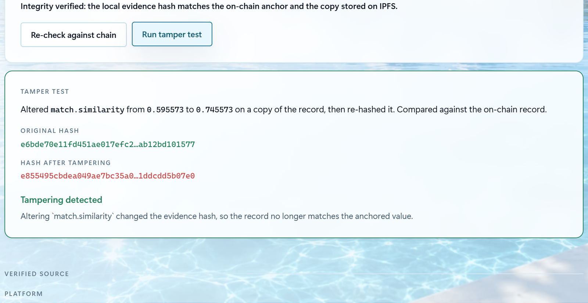
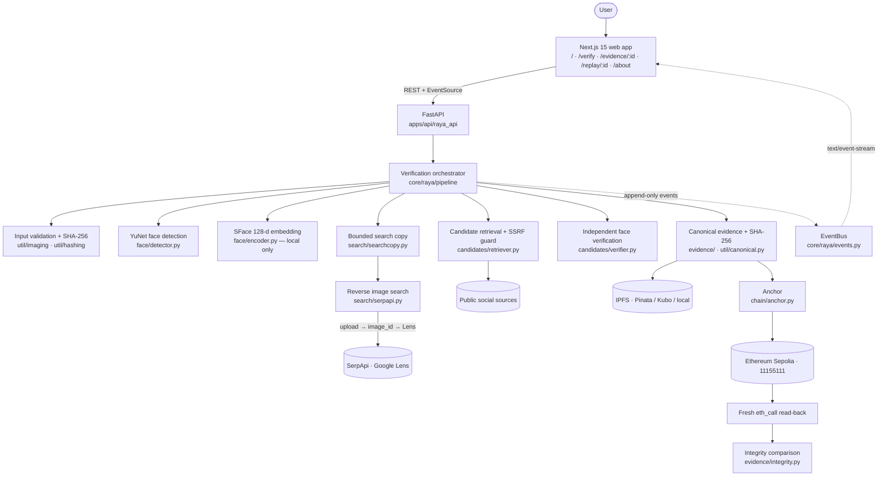

# RAYA — Discover. Verify. Anchor.
live link = https://raya-rust.vercel.app/ 
**An evidence-first visual verification pipeline that separates reverse-image discovery from independent face verification and cryptographically anchors the resulting evidence.**

> ### Discovery is not proof.

A reverse-image search engine can tell you where a face *might* appear. It cannot tell you whether the image it surfaced actually contains the same face, and it cannot stop the result from being edited afterwards. RAYA treats search as a **discovery** mechanism only: every candidate is re-downloaded from its source, re-detected and re-encoded with RAYA's own models, and scored against a configured threshold. The resulting evidence record is canonicalized, hashed with SHA-256, stored on IPFS, and anchored on Ethereum Sepolia — then read back from the chain and compared.

```
Discover  →  Verify  →  Evidence  →  IPFS  →  Ethereum
```

[](https://github.com/srthck/RAYA/actions/workflows/ci.yml)


<p align="center">
  
</p>

---

## Overview

RAYA answers one specific question:

> If a reverse-image search engine finds images that appear related to a face, how can we independently verify the candidate and preserve a tamper-evident record of the verification evidence?

Conventional reverse-image search is a **discovery** mechanism. It ranks visual neighbours. It does not perform face verification, and its ranking is not evidence. RAYA adds an independent verification layer on top of discovery, then produces a content-addressed, cryptographically committed evidence trail.

| | The search provider | RAYA |
|---|---|---|
| Discovers candidate sources | ✅ | — |
| Supplies candidate URLs and thumbnails | ✅ | — |
| Re-downloads the source image itself | — | ✅ |
| Detects the face independently | — | ✅ |
| Generates its own 128-d embedding | — | ✅ |
| Computes similarity and applies the threshold | — | ✅ |
| Produces canonical evidence and a SHA-256 digest | — | ✅ |
| Stores evidence on IPFS and anchors it on Ethereum | — | ✅ |
| Reads the anchor back and compares | — | ✅ |
| **Makes the final verification decision** | ❌ | ✅ |

**The search engine proposes. RAYA decides.**

---

## The Core Idea

Three different systems answer three different questions, and RAYA never lets one answer stand in for another.

| Question | Answered by |
|---|---|
| *Where might this image or face appear?* | The reverse-image search provider |
| *Does this independently retrieved candidate satisfy our configured face-verification policy?* | RAYA's own YuNet + SFace pipeline |
| *Has this exact evidence fingerprint been anchored without modification?* | The Ethereum Sepolia anchor and its read-back |

**RAYA does not claim that a similarity score establishes legal or real-world identity.** A cosine score above a threshold is a statement about two images under one face model — nothing more. This distinction is not a disclaimer bolted on at the end; it is shipped in the product, written into every evidence bundle's `claim` block, and rendered in the UI beside every result.

```
DISCOVERY  ≠  VERIFICATION  ≠  IDENTITY  ≠  INTEGRITY
```

---

## Product Walkthrough

Every screenshot below is a real render of the application against the real backend, all from the same anchored verification session — `VER-20260907-A09ACFB94F1F` — so the narrative is continuous from input to tamper test.

### 1. Verification interface

<p align="center">
  
</p>

**Run a real visual verification pipeline.** The dropzone accepts JPEG, PNG or WebP. The input bytes are hashed locally before anything else happens, and the eight-stage Journey rail on the left is the run's state machine — every stage begins `pending` and advances only on a backend event.

### 2. Live verification journey

<p align="center">
  
</p>

**Backend-driven verification stages.** These stages represent actual backend events delivered over Server-Sent Events — not simulated frontend timers. The run above emitted **88 events in 48.21 s**. The rail reports what each stage produced: `40 discovered`, `similarity 0.5956`, `stored on ipfs`, `block 11655688`, `hashes match`.

### 3. Candidate discovery and independent verification

<p align="center">
  
</p>

**Discovery produces candidates; RAYA independently verifies them.** Of 40 results, 6 were public social sources and 34 were filtered out. Each candidate carries its own audit trail — *public social source · image retrieved · face detected · face compared* — and reaches its own outcome. Two could not be compared at all (the face in the source image was below the minimum usable size), one was **rejected at 0.2758**, and three cleared the threshold. A rejected candidate is a working threshold, not a failure.

### 4. Verified match

<p align="center">
  
</p>

**Independent face verification.** Similarity **0.5956** against the configured **0.40** threshold. The panel is deliberately two-sided: it lists what the result establishes (a candidate source was discovered; a face was detected and encoded locally; the source image was independently retrieved; the score exceeded the threshold; evidence was anchored and matched on read-back) **and what it does not** (the real-world identity of any person; that the source itself is authentic; that no unindexed or private source exists; certainty beyond the limits of the face model).

### 5. Evidence record and integrity

<table>
<tr>
<td width="50%">

<p align="center"><b>Canonical evidence and provenance</b></p>
</td>
<td width="50%">

<p align="center"><b>Anchored on Ethereum, read back and compared</b></p>
</td>
</tr>
</table>

Three independent checks run, and each is reported separately: the local record matches its own hash (re-canonicalized and re-hashed), the on-chain hash matches the local hash (read back from the contract after confirmation), and the IPFS copy matches the local hash (re-downloaded and re-hashed).

### 6. Evidence lineage

<p align="center">
  
</p>

**Content-addressed evidence.** The lineage makes the privacy boundary legible: the original input is hashed locally and never published, and the bounded search copy sent to the provider is a **separate object with a different hash**.

### 7. Tamper detection

<p align="center">
  
</p>

**Tampering changes the fingerprint.** One field is altered on a *copy* of the record, which is then re-canonicalized and re-hashed. The digest diverges completely, and the comparison is made against **the value read back from the chain**, not against a local copy. The stored evidence is never modified by the test.

---

## Problem

Treating reverse-image-search output as proof fails for reasons that are structural, not incidental:

- **Search ranking is not identity verification.** Rankers optimise visual neighbourhood, not facial identity.
- **Visually similar images may be different people.** Pose, crop, compression and colour make near-duplicates of distinct individuals.
- **Source pages may expose a different image than the one indexed.** The thumbnail a provider returns is frequently not the image on the page.
- **Providers return noisy candidates.** Stock pages, aggregators and unrelated media are routine.
- **Evidence shown in a UI can be modified.** A screenshot proves nothing about what the backend computed.
- **A verification result without provenance is difficult to audit.** Which model? Which threshold? Which retrieved bytes?
- **Mutable application state provides no integrity guarantee.** A database row can be edited after the fact, silently.

RAYA's response is a separation of concerns: **discovery**, **verification**, and **integrity** are three distinct stages with three distinct trust models.

---

## Solution

### 01 — Discover

Real reverse-image search via Google Lens through SerpApi. A bounded, deterministically encoded derivative of the input is uploaded to obtain an `image_id`; Lens is then queried by that id. The original input is never published.

### 02 — Verify

Every social candidate is retrieved from its own source through a fallback cascade, decoded, detected with YuNet, encoded with SFace to a local 128-dimensional embedding, and compared by cosine similarity against the configured threshold. **Provider ranking is discarded at this point.** Only RAYA's own comparison decides.

### 03 — Anchor

The evidence record is serialized canonically, hashed with SHA-256, stored on IPFS, and anchored on Ethereum Sepolia in a write-once contract. A fresh `eth_call` reads the record back and compares it with the local digest. Only that comparison is permitted to produce the words "integrity verified".

---

## Architecture



### Event stream and replay

The frontend receives **actual backend pipeline events**, not simulated progress. This is confirmed by the implementation:

- `core/raya/events.py` defines an append-only `EventBus`. The orchestrator emits a typed event at every stage transition.
- `GET /v1/verifications/{id}/events` returns a `StreamingResponse` with media type `text/event-stream`, sending `X-Accel-Buffering: no` so intermediate proxies do not coalesce the stream into one final response. A late subscriber receives the backlog first, then live events.
- `apps/web/lib/usePipeline.ts` is a reducer over those events. Stage state keys off **backend error codes**, never off English prose.
- `?replay=true` re-emits a stored run's persisted event log through the same reducer, preserving the original inter-event gaps (capped at 2.5 s per gap) — which is why a replay looks like the original run rather than a uniform animation.

`/verify` and `/replay/[id]` render through the same `RunView` component, so a replay cannot diverge visually from a live run.

---

## Verification Pipeline

| # | Stage | Module | Fatal on failure? |
|---|---|---|---|
| 01 | Input validation and hashing | `util/imaging.py`, `util/hashing.py` | yes |
| 02 | Face detection (YuNet) | `face/detector.py` | yes |
| 03 | Face alignment + SFace encoding | `face/encoder.py` | yes |
| 04a | Bounded search copy | `search/searchcopy.py` | yes |
| 04 | Reverse image search (upload → `image_id` → Lens) | `search/serpapi.py` | yes |
| 05 | Candidate classification and filtering | `candidates/platforms.py` | yes |
| 06 | Candidate retrieval + independent verification | `candidates/retriever.py`, `candidates/verifier.py` | per candidate |
| 07 | Canonical evidence construction | `evidence/schema.py` | yes |
| 08 | IPFS storage | `storage/ipfs.py` | **no** |
| 09 | Blockchain anchor | `chain/anchor.py` | **no** |
| 10 | On-chain read-back | `chain/anchor.py` | **no** |
| 11 | Integrity comparison | `evidence/integrity.py` | — |

Stages 08–10 are non-fatal **by design**: a verified face match and a successful anchor are separate claims. A run that verifies a face but cannot anchor reports `verified_not_anchored` rather than discarding a real result or overstating a partial one.

### Failure states

Every one is a distinct, reported status. None is silently converted into a success or a generic error.

| Condition | Status | Behaviour |
|---|---|---|
| No face detected | `no_face_detected` | Stops before any search |
| Several faces | `multiple_faces` | Asks which is the subject; will not guess |
| Face too small to score | `face_unusable` | Refuses to produce a weak number |
| Undecodable input | `invalid_input` | Typed error to the UI |
| No search credential | `search_unavailable` | Says so; invents nothing |
| Credential rejected by provider | `search_credential_rejected` | Distinct from "not configured" |
| Zero results | `no_search_results` | Distinct from "no match" |
| No public social sources | `no_social_candidates` | Distinct from "no match" |
| All candidates below threshold | `no_verified_match` | Evidence still produced |
| Source unreachable | per-candidate `unreachable` | Run continues; provider thumbnail never trusted as the source |
| IPFS unavailable | non-fatal | Local CID computed, `published: false` |
| Chain unavailable | `verified_not_anchored` | Match preserved, reported as not anchored |
| Nothing external to compare | `integrity.inconclusive` | Reported as self-consistent only — never "integrity verified" |
| Hash mismatch | `integrity.failed` | Reported, never suppressed |

---

## Face Verification

| Property | Value |
|---|---|
| Detector | YuNet, OpenCV Zoo `2023mar`, SHA-256 pinned |
| Encoder | SFace, OpenCV Zoo `2021dec`, SHA-256 pinned |
| Embedding | 128-dimensional |
| Metric | Cosine similarity |
| Production threshold | **0.40** |
| Minimum usable face | 48 px |
| Detector score threshold | 0.9 |
| Alignment | 112 × 112 aligned crop from the five-point landmarks |
| Embedding handling | Computed locally; never written to evidence, IPFS or the chain |

Both models are loaded through the OpenCV DNN module and run entirely on the local machine. Nothing in `requirements.txt` calls a hosted face API. Model weights are downloaded by `scripts/fetch_models.py` and **verified against pinned SHA-256 digests**; the same digests are recorded in every evidence bundle, so a reviewer can confirm which weights produced a given score.

Large inputs are bounded to a 1024 px maximum edge for detection and the coordinates are scaled back, because YuNet's detection quality degrades on very large frames.

### Threshold calibration

Measured by `benchmarks/calibrate.py`; full results in [`benchmarks/calibration.json`](benchmarks/calibration.json) and [`docs/threshold-calibration.md`](docs/threshold-calibration.md).

| Metric | Value |
|---|---|
| Portraits | 88 |
| Identities | 23 |
| Genuine pairs | 128 |
| Impostor pairs | 3,700 |
| **Total pairs evaluated** | **3,828** |
| Highest observed impostor similarity | **0.3773** |
| Lowest threshold with zero observed FMR | 0.38 |
| **Shipped threshold** | **0.40** |
| FMR at 0.40 | **0.0000** (0 false matches in 3,700) |
| FNMR at 0.40 | 0.2031 |
| TPR at 0.40 | 0.7969 |
| EER | ≈ 0.0465 at threshold ≈ 0.26 |

**The threshold is deliberately precision-biased.** SFace publishes 0.363 as its cosine operating point; RAYA ships 0.40 for margin against recompressed web imagery. At that setting roughly one in five genuine pairs is missed, and that trade is intentional: in an evidence system a false positive is far more damaging than a false negative. A missed match produces "no verified match", which is honest. A false match produces a signed, anchored, permanently recorded false claim.

> **A similarity score is not equivalent to identity.** These figures characterise the pipeline on a 23-identity sample. They are not a population accuracy estimate, and none is claimed.

---

## Reverse-Image Discovery

Google Lens via SerpApi, implemented in [`core/raya/search/serpapi.py`](core/raya/search/serpapi.py).

**Direct upload, not URL publication.** `POST https://serpapi.com/image` accepts the image bytes as multipart form data and returns an `image_id`, which the Lens engine accepts in place of a `url`. The input is therefore never published to a public URL to be searched. The endpoint caps uploads at 500 KB and the id expires after roughly ten minutes.

**Results are not hardcoded.** The provider registry returns exactly one of three things, and none of them can invent a candidate:

| Provider | Behaviour |
|---|---|
| `GoogleLensProvider` | Live API call, when `SERPAPI_KEY` is set |
| `ReplayProvider` | A *recorded* live response from disk, used by tests and the offline demo. Every response is stamped `is_replay: true`; the flag travels into the evidence record and the UI labels the run a replay |
| `NullProvider` | **Raises.** It does not return an empty list, because an empty list would read as "nothing was found on the web" rather than "no search ran" |

Verify this yourself: unset `SERPAPI_KEY` and start a run. The pipeline reaches face encoding, then stops with `search_unavailable`.

Discovery sits behind a provider interface (`search/base.py`, `search/registry.py`), so an additional provider is an implementation of that interface rather than a change to the pipeline.

### The bounded search copy

RAYA never sends the original input to the provider. It derives a **separate** object: a deterministically encoded JPEG bounded to 480 KB (below the provider's 500 KB ceiling), produced by walking a fixed edge/quality ladder until the result fits.

This matters twice over. It keeps the upload inside the provider's limit deterministically, and it makes the privacy boundary explicit and auditable: **the search copy has its own SHA-256, distinct from the input's**, and both hashes appear in the evidence record. Anyone can confirm that what was sent outward is not the file that was submitted.

---

## Candidate Retrieval

Reverse-image providers routinely expose a thumbnail or a page reference instead of a directly retrievable source image. Retrieval is therefore treated as an engineering problem **separate from** face verification, implemented in [`core/raya/candidates/retriever.py`](core/raya/candidates/retriever.py).

The cascade, in order:

1. **Primary image URL** from the provider result
2. **Provider thumbnail URL**
3. **Source-page metadata**, parsed from the page HTML (bounded to 512 KB):
   - `og:image` (including `og:image:secure_url` / `og:image:url`)
   - `twitter:image` (including `twitter:image:src`)
   - `<link rel="image_src">`
   - JSON-LD `image` fields

Each retrieved image is scored on its own merits. Whichever source produced the bytes that were actually compared is recorded in the evidence as `fetched_url`, alongside the `image_url` the provider originally advertised — so the record shows both what was claimed and what was used.

Candidates are classified by host into public social platforms (X/Twitter, Instagram, Facebook, LinkedIn, YouTube, TikTok, Reddit, Pinterest, Flickr); non-social results are counted and reported, not silently dropped.

Retrieval runs with bounded concurrency (default 4) — capped to remain a polite client of the sites being fetched, not because CPU is scarce.

---

## Evidence and Provenance

The evidence record is a JSON document with `schema_version` 1.1. Top-level structure, exactly as emitted:

| Section | Contents |
|---|---|
| `verification_id` | Run identifier, also the on-chain key |
| `created_at` | ISO-8601 timestamp |
| `input` | `sha256`, `byte_size`, `mime`, `width`, `height`, and the detected `face` (bbox, landmarks, score, quality) |
| `search_copy` | `sha256`, `byte_size`, `mime`, `width`, `height`, `max_edge`, `jpeg_quality`, `resized`, and a note recording that this derivative — not the input — was sent to the provider |
| `search` | `provider`, `queried_at`, `query_image_url`, `raw_result_count`, `result_count`, `social_candidate_count`, `evaluated_count`, `performed`, `is_replay` |
| `candidates` | Every discovered candidate with its platform, URLs, outcome and reason |
| `match` | `candidate_id`, `platform`, `post_url`, `image_url`, `fetched_url`, `image_sha256`, image dimensions and size, `face_quality`, `similarity` |
| `verification` | `threshold`, `metric`, `detector` and `encoder` (name, version, **model SHA-256**), `compared_count`, `verified_count`, `rejected_count`, `processing: local`, `embedding_exported: false` |
| `claim` | `result`, `asserts`, and an explicit `does_not_assert` stating this is not an identity determination |
| `pipeline` | `name`, `version`, and the stage list |

### Why canonicalization matters

Same logical evidence → deterministic byte representation → deterministic SHA-256.

`util/canonical.py` implements an RFC 8785-shaped canonical JSON form: sorted keys, no insignificant whitespace, fixed float formatting, negative zero normalised, NaN and Infinity rejected. Without this, two semantically identical records could serialize differently and produce different digests — which would make the anchor meaningless.

The canonical bytes are what get hashed, stored and anchored. `GET /v1/verifications/{id}/evidence` returns **those exact bytes**, so `sha256sum` on the downloaded file reproduces the anchored digest. (`?pretty=true` returns an indented copy for reading, which deliberately will *not* match.)

---

## Cryptographic Integrity

SHA-256 produces a deterministic fingerprint of the canonical evidence bytes.

**The fingerprint is not the evidence.** It is an integrity commitment: a compact value that changes completely if any byte of the evidence changes. Anchoring the digest rather than the document keeps the on-chain footprint constant regardless of evidence size, and keeps the evidence itself off a public permanent ledger.

```
canonical JSON bytes ──SHA-256──▶ 32-byte digest ──▶ IPFS CID + on-chain anchor
                                        │
                                        └──▶ fresh eth_call ──▶ compare ──▶ verdict
```

---

## IPFS Evidence Storage

Implemented in [`core/raya/storage/ipfs.py`](core/raya/storage/ipfs.py). `IPFS_PROVIDER=auto` selects Pinata when `PINATA_JWT` is set, otherwise a local Kubo node, otherwise on-disk storage.

- Evidence is stored using **content addressing** — the CID is derived from the content itself.
- The CID identifies the stored bytes and is recorded both in the evidence record and on chain, so the anchor alone is enough to locate the evidence without a separate index.
- Retrieved bytes are re-downloaded and re-hashed, and compared against the expected fingerprint. That comparison is a reported integrity check, not an assumption.

On-disk mode computes a real CIDv1 but publishes nothing, and the run is labelled `published: false` rather than pretending to have pinned.

> IPFS is **content-addressed**, not immutable: content is addressed by its hash, so different bytes are a different CID, but nothing guarantees any node continues to host a given CID. The property RAYA relies on is *tamper-evidence when the retrieved content is verified against its expected hash* — not permanence.

---

## Blockchain Anchoring

| | |
|---|---|
| Network | **Ethereum Sepolia** |
| Chain ID | **11155111** |
| Contract | [`0x866704a12566dbbF2a86d6dEd0a7cB7238864032`](https://sepolia.etherscan.io/address/0x866704a12566dbbF2a86d6dEd0a7cB7238864032) |
| Deployment tx | `0x26858455f9d96d628abf59d384d9606a47c1266c91ce3814adbc3ad24b17e597` (block 11655676) |
| Contract source | [`blockchain/contracts/RayaEvidenceAnchor.sol`](blockchain/contracts/RayaEvidenceAnchor.sol) |
| Deployment record | [`blockchain/deployments/sepolia.json`](blockchain/deployments/sepolia.json) |
| Anchor gas | 253,501 |

### What is anchored

Per verification id: the evidence hash, the input hash, the source image hash, the IPFS CID, and the similarity in basis points (Solidity has no floats; basis points keep four decimal places, and the conversion is exact and reversible).

> **The blockchain stores an evidence fingerprint. It does not establish the real-world identity of the subject, and it does not make the evidence true.** It makes the evidence *tamper-evident*: a record that no longer matches its anchor has been altered since it was anchored.

### The read-back is the point

```
local evidence hash
      ↓  anchor() transaction
on-chain fingerprint
      ↓  fresh eth_call (getRecord) — not the receipt, not the logs
read-back value
      ↓  compare
verdict
```

Submitting a transaction proves nothing on its own: it can revert, be dropped, or land with different data than intended. RAYA waits for the receipt, checks `status == 1`, then makes a **fresh contract call** — deliberately not reading from the transaction receipt or its event logs, because those merely echo what was submitted. Querying contract state is what proves the chain actually holds the value. The anchor is also simulated with `eth_call` before broadcast, so a revert costs nothing and produces a readable reason.

### Contract properties

Records are **write-once**: `anchor()` reverts with `AlreadyAnchored` on an existing id, from any account, leaving the original intact. There is no privileged key and no owner — anyone can anchor, nobody can overwrite. `verifyEvidence(id, expectedHash)` performs the comparison on chain, so a bug in RAYA's client cannot manufacture a false "verified".

### Independent read-back

A reviewer can verify an anchor without running RAYA at all. This tool recomputes the digest from the file bytes itself:

```bash
cd blockchain
VERIFICATION_ID=VER-20260907-A09ACFB94F1F \
EVIDENCE_PATH=../.raya-data/runs/VER-20260907-A09ACFB94F1F/evidence.json \
npx hardhat run scripts/readback.js --network sepolia
```

It prints the on-chain record, the locally recomputed hash, the verdict, and a cross-check against the contract's own `verifyEvidence()`.

---

## Privacy Model

| What stays local | What leaves the machine |
|---|---|
| The original input bytes | The bounded search copy (a derivative with a different hash) |
| The 128-d face embedding — never exported, never written to evidence, IPFS or chain | Requests to candidate source URLs, to retrieve their images |
| Face detection and encoding (OpenCV DNN, CPU) | The evidence record, if IPFS publishing is configured |
| The evidence record, if IPFS is unconfigured (local CID only) | The evidence **hash** and IPFS CID, if anchoring is configured |

The evidence record contains provenance — hashes, URLs, model identifiers, scores — rather than raw biometric templates. `verification.embedding_exported` is `false` in every bundle, and the UI states `128d · local only · exported: never`.

**These are precise claims, not absolute ones.** Local-only *embedding processing* is not the same as a private *workflow*:

- Reverse-image discovery sends a derivative of the input to a third-party provider.
- Candidate retrieval makes requests to external websites, which observe them.
- Evidence published to IPFS is **public and content-addressed**, and the anchored CID makes it discoverable. Do not run RAYA with IPFS publishing enabled on imagery you would not publish.
- An anchored record cannot be withdrawn from the chain.

---

## Security Considerations

Implemented controls, each verifiable in the source.

### SSRF protection

Candidate URLs are attacker-influenced by definition — they come from a third-party search provider. [`retriever.py`](core/raya/candidates/retriever.py) therefore:

- restricts schemes to `http` and `https`;
- **resolves the hostname** and rejects addresses that are private, loopback, link-local, multicast or reserved;
- **re-checks after every redirect hop**, because a redirect chain can end somewhere private even when the first URL was public;
- bounds redirects (max 5), response size (12 MB per image, 512 KB per HTML page) and time (20 s default);
- is bypassable only through `allow_private_network`, which is used exclusively by the test suite's loopback fixture server and defaults to `false`.

### Threat table

| Threat | Mitigation | Residual risk |
|---|---|---|
| Search-engine false positive | Independent retrieval, detection, encoding and thresholded comparison | Similarity is still not identity proof |
| Candidate retrieval abuse (SSRF) | Scheme allow-list, DNS resolution, private-range blocking re-checked on redirect, size/time/redirect bounds | External sites remain variable and may serve different content to different clients |
| Evidence modification | Canonical serialization → SHA-256 → IPFS → on-chain anchor with fresh read-back | The anchor proves integrity, not that the original evidence was truthful |
| Frontend manipulation | Verification state derives from backend SSE events and typed error codes; the UI computes no verdicts | A screenshot of any UI is not evidence; use the exported bundle |
| Model error | Precision-biased threshold, empirical calibration, documented limitations, per-candidate quality gates | False positives and false negatives remain possible |
| Provider failure or credential rejection | Provider abstraction, typed errors distinguishing "not configured" from "credential rejected", retrieval cascade | Search coverage remains provider-dependent |
| Wrong-network anchoring | RPC chain id is compared against `CHAIN_ID` before any write; deploy script enforces the expected chain id | — |
| Secret leakage | Secrets read only from a gitignored `.env`; never returned by the API, logged, or committed | A compromised credential must be rotated by the operator |

### Secret handling

`.env` is gitignored and untracked; `.env.example` carries only empty placeholders. `GET /v1/config` reports **capability booleans** (`configured: true/false`), never credential values. `GET /v1/debug/search-config` returns a key length and a 16-hex fingerprint for diagnosis — never the key. The browser never receives `SERPAPI_KEY`, `PINATA_JWT` or `DEPLOYER_PRIVATE_KEY`, and never calls SerpApi, Pinata or an RPC endpoint directly.

> **Never commit secrets or private keys.** Use a throwaway key for `DEPLOYER_PRIVATE_KEY` that holds only test ETH.

---

## Limitations

Stated plainly, because a verification system that hides its failure modes cannot be audited. Full detail in [`docs/limitations.md`](docs/limitations.md).

- **Face similarity is not identity.** A score above threshold means two images are similar under one model. It is not a legal, biometric or forensic identity determination.
- **The threshold is a policy choice.** 0.40 is precision-biased and misses roughly 20% of genuine pairs in calibration. A different threshold produces different verdicts; this is why it is recorded in every bundle.
- **False negatives are common by design.** "No verified match" does not mean the person is absent from the web.
- **Image quality dominates.** Small faces (below 48 px), heavy compression, motion blur and extreme crops are rejected or degrade scoring.
- **Pose, lighting, age and demographic variation affect embeddings.** The 23-identity calibration set is far too small to characterise performance across populations, and no per-demographic performance is claimed.
- **Search coverage is bounded by the provider.** Google Lens indexes a subset of the web. Absence of results is not evidence of absence.
- **Some source images cannot be retrieved.** Sites block automated requests, require authentication, expire CDN URLs or serve different content to different clients. The retrieval cascade reduces this; it does not eliminate it.
- **Public evidence has privacy implications.** IPFS-published evidence is public and content-addressed.
- **Anchoring proves integrity, not factual correctness.** A truthful-looking anchored record can still be built on a misidentified source.
- **Ethereum Sepolia is a test network.** It carries no economic security guarantees and may be reset. This is a demonstration of the anchoring mechanism, not production settlement.
- **The evidence trail is only as trustworthy as its inputs.** RAYA proves what it retrieved and computed — not that the source page is authentic or that the depicted event occurred.

---

## Threat Model

| Threat | What RAYA protects against | What RAYA does **not** guarantee |
|---|---|---|
| Tampered evidence | Any post-hoc modification of the record is detected by hash divergence against the anchor | That the original evidence was truthful |
| Search false positives | Provider ranking is discarded; every candidate is re-verified independently | That a verified match establishes legal identity |
| Frontend manipulation | Verification state is backend-derived and reproducible from the exported bundle | That a rendered UI is inherently trustworthy |
| Candidate URL abuse | SSRF controls on scheme, resolved address, redirects, size and time | That arbitrary external websites are trustworthy or stable |
| Silent capability failure | Unconfigured capabilities are reported as UNAVAILABLE / NOT RUN and omitted from evidence | That every run reaches an anchored state |

Extended analysis in [`docs/threat-model.md`](docs/threat-model.md).

---

## Technology Stack

| Layer | Technology |
|---|---|
| Frontend | Next.js 15, React 19, TypeScript 5.7, Framer Motion. No UI framework, no icon library, no CSS framework — the design system is CSS custom properties |
| Backend | Python, FastAPI, Uvicorn, Pydantic v2, pydantic-settings, httpx |
| Computer vision | OpenCV (`opencv-python-headless`), DNN module, NumPy, Pillow |
| Face detection | YuNet `2023mar` (OpenCV Zoo), SHA-256 pinned |
| Face representation | SFace `2021dec` (OpenCV Zoo), 128-d embeddings, cosine metric |
| Reverse image search | Google Lens via SerpApi (direct image upload → `image_id`) |
| Storage | IPFS — Pinata, local Kubo node, or on-disk CIDv1 |
| Cryptography | SHA-256 over RFC 8785-shaped canonical JSON |
| Blockchain | Solidity ^0.8.24, Hardhat, Ethers, web3.py, Ethereum Sepolia (11155111) |
| Realtime | Server-Sent Events over an append-only in-process event bus |
| Testing | pytest, pytest-asyncio, Hardhat/Mocha, `tsc --noEmit`, Playwright (layout QA) |
| CI | GitHub Actions — Python on Ubuntu **and** Windows, Solidity, frontend |
| Deployment | Vercel (frontend); the API runs wherever the models and secrets live |

---

## Repository Structure

```
RAYA/
├── apps/
│   ├── api/raya_api/          FastAPI application, runtime, SSE endpoints
│   └── web/                   Next.js 15 app router frontend
│       ├── app/               /, /verify, /evidence/[id], /replay/[id], /about
│       ├── components/        RunView, JourneyRail, CandidateWall, TechPanel, …
│       └── lib/               api.ts, usePipeline.ts (SSE reducer), types.ts
├── core/raya/                 The verification engine — no web framework here
│   ├── face/                  YuNet detector, SFace encoder, alignment, types
│   ├── search/                Provider interface, SerpApi/Lens, search copy, registry
│   ├── candidates/            Platform classifier, SSRF-guarded retriever, verifier
│   ├── evidence/              Canonical schema, bundle, integrity comparison
│   ├── storage/               IPFS (Pinata / Kubo / on-disk CIDv1)
│   ├── chain/                 EVM anchor, ABI, read-back
│   ├── pipeline/              Orchestrator, result model, run store
│   ├── util/                  Canonical JSON, hashing, imaging
│   ├── events.py              Append-only EventBus feeding SSE
│   ├── config.py              Pydantic settings, .env loading
│   └── errors.py              Typed errors carrying stable codes
├── blockchain/
│   ├── contracts/             RayaEvidenceAnchor.sol
│   ├── scripts/               deploy.js (with live round-trip), readback.js
│   ├── test/                  17 contract tests
│   └── deployments/           sepolia.json — deployed address and tx
├── benchmarks/                bench.py, calibrate.py, calibration.json
├── demo/run_demo.py           Five end-to-end demonstration cases
├── scripts/                   fetch_models.py, fetch_calibration_set.py, layout_qa.py
├── tests/                     Python test suite + fixtures
├── docs/                      architecture, limitations, threat-model,
│                              threshold-calibration, benchmarks, compliance, screenshots
└── .github/workflows/ci.yml   Python (Ubuntu + Windows), Solidity, frontend
```

---

## Quick Start

### Prerequisites

- Python 3.10+
- Node.js 20+
- Git

A `SERPAPI_KEY` is required for live reverse-image search. `PINATA_JWT` and a funded Sepolia key are optional — without them RAYA reports those capabilities as unavailable rather than faking them.

### 1. Clone

```bash
git clone https://github.com/srthck/RAYA.git
cd RAYA
```

### 2. Environment

```bash
cp .env.example .env
```

Then fill in `.env`. **Never commit it — it is gitignored, and it must stay that way.** Never paste a private key that holds real value.

### 3. Backend

```bash
python -m venv .venv
# Windows:  .venv\Scripts\activate
# macOS/Linux: source .venv/bin/activate

pip install -r requirements.txt
python scripts/fetch_models.py     # downloads YuNet + SFace, verifies pinned SHA-256

# macOS/Linux
PYTHONPATH="core:apps/api" uvicorn raya_api.main:app --port 8000
# Windows PowerShell
$env:PYTHONPATH="core;apps/api"; uvicorn raya_api.main:app --port 8000
```

### 4. Frontend

```bash
cd apps/web
npm install
npm run build      # NEXT_PUBLIC_API_URL is baked in at BUILD time
npm start          # http://localhost:3000
```

> `next.config.mjs` rewrites `/api/*` to the backend so the browser makes **same-origin** requests — `EventSource` has no CORS escape hatch, and the SSE stream carries the entire live UI. Because Next resolves rewrites at build time, `NEXT_PUBLIC_API_URL` must be set before `npm run build`, not before `npm start`. The default is `http://127.0.0.1:8000`.

### 5. Blockchain (optional)

```bash
cd blockchain
npm install
npm test                # 17 contract tests
npm run deploy          # deploys to Sepolia, then round-trips a record before declaring success
# copy the printed CONTRACT_ADDRESS into .env, then restart the API
```

The deploy script refuses to run against an unexpected chain id and performs a live write → read-back → compare before reporting success.

### 6. Offline demonstration

```bash
python demo/run_demo.py            # five cases against the real pipeline
python demo/run_demo.py --case C
```

---

## Environment Variables

From [`.env.example`](.env.example). No real credential appears in this repository.

| Variable | Purpose | Required | Notes |
|---|---|---|---|
| `SEARCH_PROVIDER` | Selects the discovery provider | no | `serpapi` |
| `SERPAPI_KEY` | SerpApi credential for Google Lens | **for live runs** | Without it: `search_unavailable`; no candidate is ever invented |
| `PUBLIC_BASE_URL` | Public origin, if this API is itself internet-reachable | no | Not needed for the default direct-upload search path |
| `IPFS_PROVIDER` | `auto` \| `pinata` \| `kubo` \| `local` | no | `auto` prefers Pinata, then Kubo, then on-disk |
| `PINATA_JWT` | Pinata credential | no | Absent → local CIDv1 only, `published: false` |
| `PINATA_GATEWAY` | Pinata gateway origin | no | `https://gateway.pinata.cloud` |
| `KUBO_API_URL` | Local IPFS node API | no | `http://127.0.0.1:5001` |
| `IPFS_PUBLIC_GATEWAY` | Public gateway for links | no | `https://ipfs.io` |
| `CHAIN_RPC_URL` | EVM JSON-RPC endpoint | no | `https://ethereum-sepolia-rpc.publicnode.com` |
| `CHAIN_ID` | Expected chain id | no | `11155111` — compared against the RPC before any write |
| `CHAIN_NAME` | Display name | no | `Ethereum Sepolia` |
| `CHAIN_CURRENCY` | Gas currency symbol | no | `ETH` |
| `CHAIN_EXPLORER` | Explorer base URL | no | `https://sepolia.etherscan.io` |
| `CONTRACT_ADDRESS` | Deployed anchor contract | for anchoring | Set after `npm run deploy` |
| `DEPLOYER_PRIVATE_KEY` | Signing key for anchor transactions | for anchoring | **Test key only.** Never a key holding real value |
| `SIMILARITY_THRESHOLD` | Cosine verification threshold | no | `0.40` — recorded in every evidence bundle |
| `FACE_SCORE_THRESHOLD` | Minimum detector confidence | no | `0.9` |
| `MIN_FACE_SIZE_PX` | Minimum usable face size | no | `48` |
| `MAX_CANDIDATES` | Cap on discovered candidates | no | `40` |
| `MAX_VERIFIED_CANDIDATES` | Cap on candidates compared | no | `12` |

---

## API

FastAPI, mounted under `/v1`. Interactive OpenAPI documentation is served at **`/docs`**.

| Method | Path | Purpose |
|---|---|---|
| `GET` | `/v1/health` | Liveness — `{status, version, time}` |
| `GET` | `/v1/config` | Models, thresholds, limits, and capability booleans for search / storage / chain. **Never returns credentials** |
| `GET` | `/v1/debug/search-config` | Diagnostic: key presence, length and a 16-hex fingerprint — never the key |
| `POST` | `/v1/uploads` | Multipart image upload. Detects faces and returns them **without searching anything**, so the multi-face case is resolved up front. No network call leaves the machine at this point |
| `POST` | `/v1/verifications` | Starts a run from `{upload_id, face_index?}`. Returns `202` with `verification_id`, `events_url`, `result_url`. `face_index` is required when several faces were detected |
| `GET` | `/v1/verifications` | Lists recent runs |
| `GET` | `/v1/verifications/{id}` | Full result, or `{status: "running"}` while in flight |
| `GET` | `/v1/verifications/{id}/events` | **SSE stream** (`text/event-stream`). Live events from the bus, with backlog replay for late subscribers. `?replay=true&speed=1.0` re-emits a stored run's log at its original pacing |
| `GET` | `/v1/verifications/{id}/evidence` | The **canonical evidence bytes** — `sha256sum` reproduces the anchored digest. `X-Evidence-SHA256` header. `?pretty=true` returns a readable copy that will not match |
| `GET` | `/v1/verifications/{id}/assets/{filename}` | Input face crop and retrieved candidate images |
| `GET` | `/v1/verifications/{id}/integrity` | Re-runs the integrity check **now**, re-reading the contract rather than returning a stored report |
| `POST` | `/v1/verifications/{id}/tamper` | Alters one field on a **copy** and shows the digest diverge. Compared against the on-chain value when anchored. Stored evidence is never modified |
| `GET` | `/v1/verifications/{id}/export` | ZIP bundle: `evidence.json` (canonical), `evidence.pretty.json`, `verification.json`, `events.json`, `integrity.txt`, `README.txt` |

Typed pipeline errors are returned as `{"error": {"code", "message"}}` with stable codes, so the frontend switches on codes rather than parsing prose.

---

## Web Application

| Route | Purpose |
|---|---|
| `/` | Landing — the thesis and the pipeline |
| `/verify` | Upload an image and watch the live run |
| `/evidence/[id]` | Evidence record, integrity checks, on-chain anchor, tamper test, full candidate table, downloads |
| `/replay/[id]` | Re-play a stored run's real event log at its original pacing |
| `/about` | How it works, and the documented limitations |

The UI launches verifications, streams pipeline progress from SSE, lets you inspect every discovered candidate and its outcome, exposes the evidence record and its hashes, replays past runs, and reports integrity state. `/verify` and `/replay/[id]` share the same `RunView` component so live and replayed runs cannot drift apart.

---

## Testing

```bash
pytest                                  # Python: 168 passed, 1 skipped
cd blockchain && npx hardhat test       # Solidity: 17 passing
cd apps/web && npx tsc --noEmit         # TypeScript: clean
cd apps/web && npm run build            # Next.js production build
python scripts/layout_qa.py             # Playwright geometric layout QA
```

| Suite | Tests | Covers |
|---|---|---|
| `tests/test_face.py` | 21 | Detection, encoding, similarity separation |
| `tests/test_evidence.py` | 35 | Canonicalization, hashing, integrity, tamper, CID |
| `tests/test_candidates.py` | 33 | Platform classification, SSRF guard, filtering |
| `tests/test_pipeline.py` | 23 | End-to-end runs, failure modes, events, persistence |
| `tests/test_search_copy.py` | 25 | Search-copy bounds and determinism, upload, `image_id`, provider failures, credential absence |
| `tests/test_retrieval_cascade.py` | 15 | `image_url` → thumbnail → page-metadata cascade |
| `tests/test_contract_abi.py` | 17 | Python ABI vs compiled artifact, basis-point round-trip |
| `blockchain/test/` | 17 | Anchoring, write-once immutability, validation, integrity checks, enumeration, gas budget |

Tests run against the **real models and real fixture photographs** — mocking the encoder would leave the one claim that matters, that RAYA's own comparison separates people, completely untested. `test_the_threshold_sits_in_a_real_margin` fails the build if the separation between same-person and nearest different-person scores falls below 0.3, and the contract suite fails the build if `anchor()` exceeds 300,000 gas.

`scripts/layout_qa.py` asserts on **geometry rather than CSS**: it loads the page in Chrome at six viewports and four scroll positions and checks pairwise region overlap, horizontal clipping, `scrollWidth === clientWidth`, and that exactly one journey rail and one nav render.

No coverage percentage is claimed, because none has been measured.

---

## Key Engineering Decisions

**Search ≠ verification.** The provider discovers; RAYA decides. Provider ranking never reaches the verdict. Every positive result must survive an independent retrieval-and-comparison step.

**Local embeddings.** Face vectors are computed on the machine running the pipeline, are never sent to any external service, and are never written to evidence, IPFS or the chain. `embedding_exported: false` appears in every bundle.

**A bounded search copy, not the original.** The object sent to the provider is a deterministic derivative with its own hash, so the privacy boundary is auditable rather than asserted.

**Precision-biased threshold.** 0.40 over SFace's published 0.363, accepting ~20% FNMR to hold FMR at zero across 3,700 impostor pairs. In an evidence system, a false positive is the expensive error.

**Canonical evidence before hashing.** Deterministic serialization is what makes the integrity commitment meaningful; without it, identical evidence could produce different digests.

**Hash before anchor.** The chain stores a 32-byte commitment, not the document. Constant on-chain footprint, and the evidence itself stays off a permanent public ledger.

**Read back with a fresh call.** Never from the receipt or its logs — those are what we submitted. Only a fresh `eth_call` comparison may produce the words "integrity verified".

**Non-fatal anchoring.** A verified face match and a successful anchor are separate claims, so a chain failure downgrades the status rather than discarding a real result.

**Event-driven frontend.** SSE exposes real backend progress. No timer advances pipeline state: the only two `setTimeout` calls in the frontend remount the replay stream and reset a "copied" label. Stage state keys off typed error codes rather than English prose — an earlier bug where the UI regex-matched a message and painted an unconfigured chain as *failed* is exactly why.

**Provider abstraction.** Discovery sits behind an interface with three implementations, one of which deliberately raises rather than returning an empty list.

**Retrieval cascade separate from verification.** Getting the bytes is an engineering problem; deciding what they mean is a verification problem. Conflating them is how systems end up trusting thumbnails.

**Typed errors with stable codes.** Every failure is a distinct, reportable state rather than a generic 500.

---

## Demonstration Flow

1. Submit an image → hashed locally before anything else
2. Detect the face with YuNet
3. Generate a local 128-d SFace embedding
4. Build the bounded search copy (distinct hash)
5. Run the real reverse-image search via Google Lens
6. Classify and filter discovered candidates
7. Retrieve each candidate's image through the fallback cascade
8. Detect, encode and compare each independently → verified / rejected / not compared
9. Generate canonical evidence
10. Compute the SHA-256 fingerprint
11. Store the evidence on IPFS
12. Anchor the fingerprint on Ethereum Sepolia
13. Read the fingerprint back with a fresh `eth_call` and compare
14. Alter one field on a copy → watch the digest diverge and the comparison fail

**Discover. Verify. Anchor.**

---

## Deployment

```
User → Vercel (Next.js) → RAYA API (FastAPI) → SerpApi · IPFS · Ethereum Sepolia
```

The frontend is deployed on Vercel at [raya-rust.vercel.app](https://raya-rust.vercel.app). Deployment of the API is **optional and not currently public**: the models, the search credential and the signing key all live server-side, and the public frontend's `/api/*` rewrite currently resolves to a local address.

To run the full stack publicly, host the FastAPI service somewhere reachable and rebuild the frontend with `NEXT_PUBLIC_API_URL` pointing at it — the rewrite is resolved at build time, so the variable must be set before `npm run build`. Secrets stay server-side: the browser never receives `SERPAPI_KEY`, `PINATA_JWT` or `DEPLOYER_PRIVATE_KEY`, and never calls SerpApi, Pinata or an RPC endpoint directly.

Everything in this README can be reproduced locally with `pytest`, `npx hardhat test`, `npm run build` and `python demo/run_demo.py`.

---

## Responsible Use

RAYA must **not** be used as the sole basis for:

- legal identity decisions
- employment decisions
- law-enforcement decisions
- financial eligibility decisions
- medical decisions
- any other high-impact decision about a person

Face verification is probabilistic. A cosine similarity score is a measurement of two images under one model, subject to the error rates and population limits documented above, and it must be interpreted in context by a human who understands those limits. RAYA is built to make that context inspectable — which is why every result ships with what it does *not* establish.

---

## Roadmap

Clearly labelled as **future work**; none of the following is implemented.

- Additional reverse-image search providers behind the existing provider interface
- Stronger candidate ranking and de-duplication before verification
- Broader, more representative benchmark datasets
- Threshold calibration across wider populations, with per-slice reporting
- Production-network deployment, with the economic and governance analysis that requires
- Alignment with established provenance standards (e.g. C2PA-style manifests)
- Richer evidence schemas, including multi-subject and multi-source records
- Additional anti-abuse controls on retrieval
- Research into privacy-preserving verification that avoids sending any derivative outward

---

## Project

**RAYA** — Discover. Verify. Anchor.

Visual evidence verification: computer vision, independent face verification, cryptographic evidence, and blockchain anchoring.

- Repository: <https://github.com/srthck/RAYA>
- Contract: [`0x866704a12566dbbF2a86d6dEd0a7cB7238864032`](https://sepolia.etherscan.io/address/0x866704a12566dbbF2a86d6dEd0a7cB7238864032) on Ethereum Sepolia
- License: [MIT](LICENSE)

### Further documentation

| Document | Contents |
|---|---|
| [`docs/architecture.md`](docs/architecture.md) | System design and module boundaries |
| [`docs/threshold-calibration.md`](docs/threshold-calibration.md) | How 0.40 was chosen, with the full sweep |
| [`docs/benchmarks.md`](docs/benchmarks.md) | Measured stage costs, gas, bundle sizes |
| [`docs/limitations.md`](docs/limitations.md) | What RAYA cannot do |
| [`docs/threat-model.md`](docs/threat-model.md) | Adversaries, controls, residual risk |
| [`docs/compliance.md`](docs/compliance.md) | Every requirement mapped to code and proof |

---

<p align="center">
  <b>Discovery isn't proof.</b><br>
  <sub>The search engine proposes. RAYA decides. The chain remembers the digest — nothing more, and nothing less.</sub>
</p>
